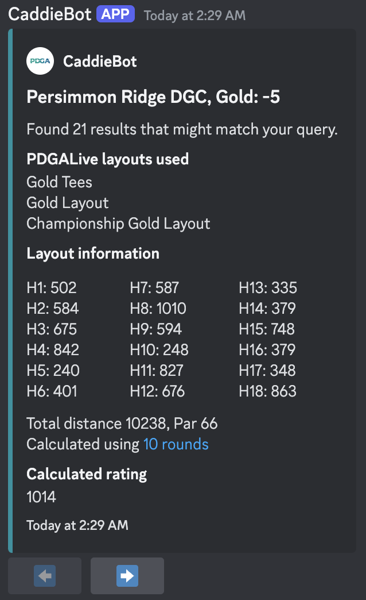

### CaddieBot

CaddieBot serves as a PDGA round rating calculator for Discord, aggregating tournament results for any disc golf course and layout.

The bot uses tournaments from discgolfscene.com, with score & rating data from cooresponding pdgalive.com pages.

Web interface coming soon!

### Example Usage

**/get_ratings**
**course_name:** Persimmon Ridge DGC
**layout_name:** Gold
**score:** -5

### Resources

[Invite the bot here](https://discord.com/oauth2/authorize?client_id=1300645264591294475&permissions=8&integration_type=0&scope=bot)
Contact me with suggestions, or to help contribute!
