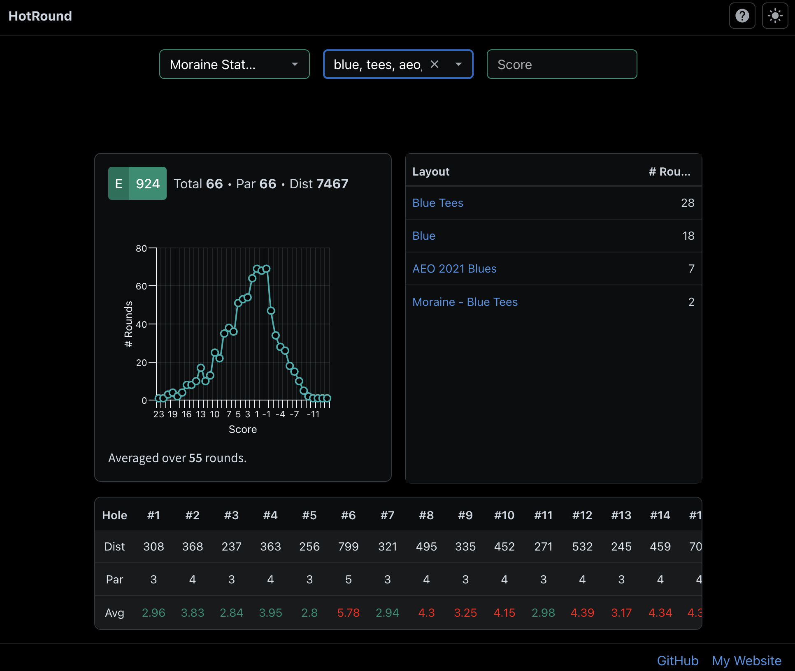

## HotRound

**HotRound** aggregates PDGA sanctioned tournament data to calculate accurate disc golf round ratings for casual, non-sanctioned rounds.

**[hotround.site](https://hotround.site)** • **[Discord Bot](https://discord.com/oauth2/authorize?client_id=1300645264591294475)** • **[Kaggle dataset](https://www.kaggle.com/datasets/tobiasbeidlershenk/pdga-sanctioned-disc-golf-tournament-data)**

### How it works

The tool uses a database of `~10,000` courses, `~20,000` tournaments, `~300,000` rounds to generate ratings for any arbitrary course and tee/basket layout.

PDGALive layouts often differ by small amounts from tournament to tournament, with different names and pin-positions. HotRound groups layouts by similarity metrics, such as `distance` and `par` of each hole using a fuzzy-matching algorithm.

### Example Usage

### Built using

The **frontend** site is built using the **Flask** web framework to serve a **ReactJS** application. The discord bot is built using the **Disnake** python library. The dataset used by the project was scraped using **Selenium** and stored in a **SQL** database.Then finally applications are deployed using **Docker** and **Heroku**.

### Credits

The data used in this project was sourced through web scraping from [PDGALive](https://pdga.com/live) and is not being used for commercial purposes.
